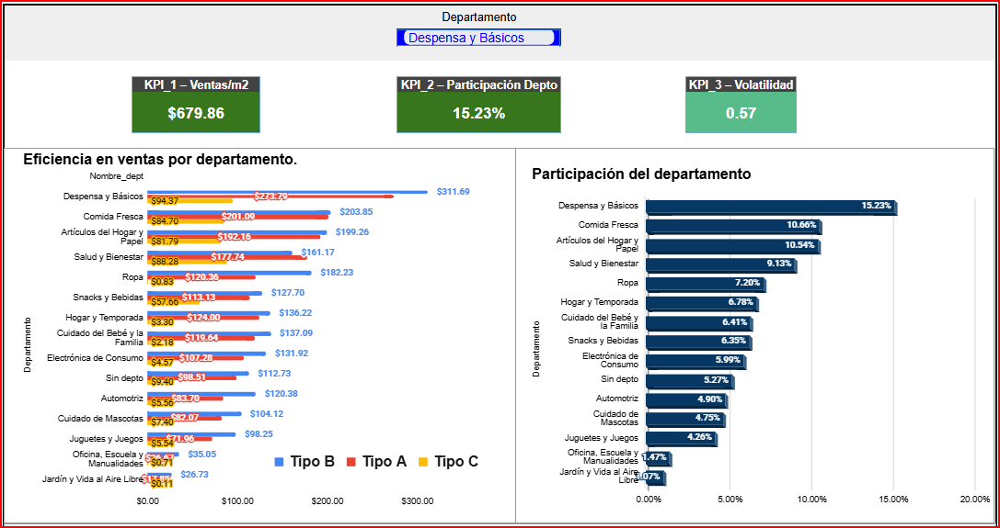

# 🛒 Walmart BI Architecture - Relational Analysis


## 📌 Resumen
Este proyecto consiste en un análisis detallado de las ventas de Walmart (2010-2012) para identificar la eficiencia operativa de las tiendas, la participación de los departamentos y los riesgos por volatilidad. El objetivo es transformar datos crudos en insights accionables para la toma de decisiones estratégicas.En otras palabras se basa en el análisis de eficiencia operativa para Walmart usando lógica multicapa relacional.

La Dirección Comercial de Walmart necesitaba responder tres preguntas
clave para ajustar presupuesto e inventario en 2012:

1. ¿Qué tiendas y tipos de tienda generan más ventas por metro cuadrado?
2. ¿Qué departamentos concentran la mayor participación en ingresos?
3. ¿Dónde existe mayor riesgo por volatilidad de ventas?

Este proyecto construye la arquitectura de datos y un dashboard ejecutivo
interactivo en Sheets para responder esas tres preguntas con KPIs
cuantificados.


## 🛠️ Herramientas Utilizadas
* **Google Sheets / Excel:** Procesamiento, limpieza y creación de Dashboards.
* **Técnicas de Limpieza:** Manejo de duplicados, corrección de formatos de fecha y estandarización de categorías.
* **Métricas Analíticas:** Cálculo de KPI de eficiencia, participación y coeficiente de variación.

## 🧠 Arquitectura MVC
1. **Raw**: Tablas ventas, departamento, tiendas.
2. **Transformación**: Unión relacional (Primary/Foreign Keys).
3. **Analítica**: KPIs financieros.
4. **Presentación**: Dashboard interactivo.


| Hoja | Descripción | Tipo |
|---|---|---|
| `raw_ventas` | Ventas semanales por tienda y departamento | Raw Data |
| `raw_departamento` | Relación de cada departamento por tienda | Raw Data |
| `raw_tiendas` | Clasificación de tienda y tamaño en m² | Raw Data |
| `Ventas_Clean` | Dataset limpio post-procesamiento | Datos |

## QA y Validaciones

| Chequeo | Resultado |
|---|---|
| Tiendas sin departamento asignado | 6,435 registros sin depto (campo "Sin depto") |
| Ventas totales Pivot = Raw Data | $2.00 de diferencia — validado como correcto |
| Ventas negativas o nulas | 27 registros con ventas nulas detectados |
| Tamaños en m² = 0 | 0 registros — sin problema |
| Coeficiente de Variación > 2.0 | Ninguna tienda supera CV = 2.0 — dentro del rango |


## 🔬 Hallazgos
  Detectados 6,435 registros sin departamento asignado.
  Identificados 27 registros con ventas nulas o negativas.
  "Data Cleaning" 
  
* 🌟 **ROI Superficie**: "Las tiendas de Tipo B son altamente eficientes, pero las Tipo A dominan en volumen total. Las tiendas Tipo C son el punto débil, aportando solo el 10% Tiendas Tipo A son 25% más eficientes que Tipo C.
* 🚨 **Fricción Inventario**: Ahorro potencial del 15% en Electrónica (picos vs valles).
* 🏘️ **Mix Ganador**: "Hogar" domina en regiones de baja densidad.
## Estructura de Datos

## KPIs Definidos

**KPI 1 — Eficiencia: Ventas / m²**
Ventas totales del año divididas entre el tamaño de la tienda en metros cuadrados.
Referencia: Tienda 1 generó $16,444,027.12 en 2012.

**KPI 2 — Participación: VentasDepto / VentasTotales**
Porcentaje que aporta cada departamento sobre el total de ventas.
Referencia: Despensa y Básicos lidera con 15.23% de participación.

**KPI 3 — Volatilidad: STDEV / AVERAGE (12 semanas)**
Coeficiente de Variación — mide riesgo e inestabilidad por tienda.
Referencia: CV = 0.57 para Despensa y Básicos — variabilidad baja, operación estable.

## Hallazgos Principales

**KPI 1 — Eficiencia por tipo de tienda**
- Tipo B tiene el mejor desempeño global, representando ~46% del total combinado
- Tipo C aporta solo el 10% — bajo rendimiento que requiere revisión estratégica
- Implicación: Las tiendas Tipo C pueden requerir ajustes en estrategia
  comercial o de distribución antes de ampliar inversión en ese formato

**KPI 2 — Participación por departamento**
- 5 departamentos concentran el 56.9% del total de ingresos:
  Despensa y Básicos (15.23%), Comida Fresca (10.66%),
  Artículos del Hogar y Papel (10.54%), Salud y Bienestar (9.13%), Ropa (7.20%)
- Las categorías especializadas aportan menos del 5% cada una
- Alerta: El campo "Sin depto" (5.27%) puede contener ventas no
  clasificadas que distorsionan la participación real — requiere depuración
- Implicación: Alta dependencia del consumo esencial. Cualquier cambio
  en precio o suministro de estas categorías impacta directamente la
  facturación total

**KPI 3 — Volatilidad por tienda**
- Tiendas con CV < 0.6: desempeño constante y predecible
- Tiendas con CV > 1.2: alta volatilidad — inconsistencia operativa y de demanda
- Implicación: Estandarizar prácticas tomando como referencia las tiendas
  estables para reducir riesgo en la red comercial

## Vista del Dashboard



*Dashboard interactivo con filtro por departamento. Vista mostrada:
Despensa y Básicos — KPI1: $679.86/m² | KPI2: 15.23% | KPI3: CV 0.57*

## Acceso a los Datos

[Ver archivo en Google Sheets]([https://docs.google.com/spreadsheets](https://docs.google.com/spreadsheets/d/1ruhaUG9n1VCUbC-RXhsXp_SO2GCLdbHTn9Lt2RxMkos/edit?usp=drive_link)

## Estructura del Repositorio
```text
📦 Proyecto-2-Ventas-Walmart-BI-Architecture
 ┣ 📂 img
 ┃ ┗ 🖼️ Dashboar_P2.png          → Vista del dashboard ejecutivo interactivo
 ┣ 📊 Ventas_Walmart.pbix         → Archivo Power BI (requiere Power BI Desktop)
 ┣ 📝 README.md                   → Este archivo
```
## Cómo Visualizar el Dashboard

1. Descarga el archivo `Ventas_Walmart.pbix` de este repositorio
2. Ábrelo con **Power BI Desktop** (descarga gratuita en microsoft.com)
3. Usa el filtro **"Departamento"** en la parte superior para explorar
   los KPIs por categoría de producto

## 📝 Mi rol
Mi proyecto consiste en asumir el rol de analista en Walmart, donde la Dirección Comercial necesita un resumen ejecutivo para ajustar presupuestos e inventario. Trabajo con datos de ventas semanales de 2012, que incluyen información de tiendas, departamentos y ventas.


### AUTOR:
David Germán Ramos Rodríguez
[LinkedIn](https://www.linkedin.com/in/david-g-ramos/) | 
[Sitio Web](https://dataanalist-davidgramos.github.io/mi-sitio-web/)

